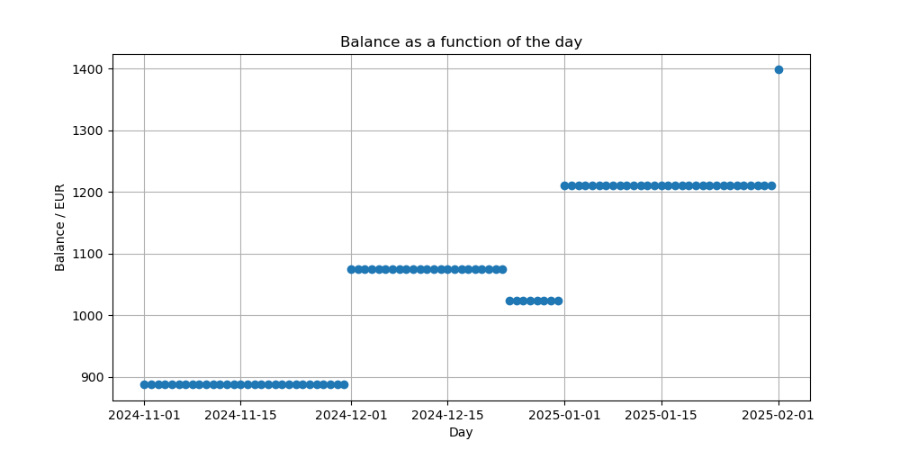

# Fynance

## Target

Creation of a simple yet powerful program for modelling financial balances.

## Key features

The user can create balance objects and add transactions. The value in a transaction can be positiv or negativ. A positiv value corrispondes to a gain or income. The resolution in the time dimension is a day. The balance on a particual day equals the initial value of the balance plus the sum over all values preceding and including the day.

## Example

The balance can be plotted in a desired interval.

